# Refactorización flujo empresa y onboarding enterprise

## Contexto actual

- **Registro:** [RegisterForm.tsx](web/src/components/react/RegisterForm.tsx) ya permite elegir Usuario/Empresa; si Empresa pide nombre de empresa.
- **Login Google:** [login.astro](web/src/pages/[lang]/login.astro) llama `auth.loginWithGoogle(credential)` sin opciones; no pide tipo de cuenta.
- **API Google:** [api/auth/google.ts](web/src/pages/api/auth/google.ts) para usuarios existentes usa `user.account_type` de BD y no permite cambiarlo.
- **Onboarding enterprise:** [OnboardingEnterpriseWizard.tsx](web/src/components/react/OnboardingEnterpriseWizard.tsx) es un único formulario (nombre, ciudad, teléfono, dirección).
- **Estilos:** Hay colores hardcodeados (`gray-100`, `gray-400`, `#E8F1EF`, `red-50`) en RegisterForm y otros componentes.

---

## 1. Actualizar codemaps (pre-requisito)

Ejecutar el comando `update-codemaps` para generar/actualizar:

- `codemaps/architecture.md`
- `codemaps/backend.md`
- `codemaps/frontend.md`
- `codemaps/data.md`

Usar TypeScript/Node.js para analizar imports/exports. Guardar diff en `.reports/codemap-diff.txt`. Si cambios > 30%, solicitar aprobación.

---

## 2. Eliminar colores y fuentes hardcodeadas

**Archivos a corregir:**


| Archivo                                                       | Cambios                                                                                                                                                     |
| ------------------------------------------------------------- | ----------------------------------------------------------------------------------------------------------------------------------------------------------- |
| [RegisterForm.tsx](web/src/components/react/RegisterForm.tsx) | `gray-100` → `tropical-bg` o `tropical-secondary/10`; `gray-400` → `tropical-text/50`; `#E8F1EF` → `tropical-secondary/10`; `red-50` → `tropical-accent/10` |
| [global.css](web/src/styles/global.css)                       | Añadir variables para estados de error si faltan                                                                                                            |
| Cualquier otro componente con hex/gray                        | Auditar y reemplazar por `tropical-`*                                                                                                                       |


**Regla:** Nunca usar `#hex`, `gray-`*, `red-`* directamente; siempre `text-tropical-text`, `bg-tropical-bg`, `border-tropical-secondary/20`, etc.

---

## 3. Refactorizar registro (mantener y mejorar)

- Mantener selector Usuario/Empresa en [RegisterForm.tsx](web/src/components/react/RegisterForm.tsx).
- Si Empresa: nombre de empresa obligatorio (ya existe).
- Añadir i18n para todos los textos (actualmente hay mezcla de hardcoded español).
- Corregir estilos con variables tropical.

---

## 4. Login con Google: siempre preguntar tipo de cuenta

**Flujo deseado:** Antes de llamar a `/api/auth/google`, el usuario debe elegir "Jugador" o "Empresa". Si Empresa, pedir nombre de empresa.

**Cambios:**

1. **Login page** [web/src/pages/[lang]/login.astro](web/src/pages/[lang]/login.astro):
  - Convertir el bloque de Google en un flujo de 2 pasos (o modal):
    - Paso 1: Botón "Continuar con Google" → abre selector de cuenta Google.
    - Paso 2: Tras obtener credential, mostrar selector "¿Cómo quieres acceder?" (Jugador / Empresa). Si Empresa, input nombre empresa.
  - Alternativa más simple: mostrar el selector de tipo de cuenta + nombre empresa (si Empresa) **antes** de pulsar Google, igual que en RegisterForm.
2. **API** [web/src/pages/api/auth/google.ts](web/src/pages/api/auth/google.ts):
  - Para usuarios **existentes**: aceptar `accountType` y `organizationName` en el body.
  - Si el usuario existe y se envía `accountType` distinto al actual:
    - Actualizar `users.account_type` al nuevo valor.
    - Si pasa de customer → enterprise: crear organización si hay `organizationName`, vincular `users.organization_id`.
    - Si pasa de enterprise → customer: no eliminar organización (el usuario puede tener datos); solo cambiar `account_type`. Opcional: desvincular `organization_id` si se desea.
  - Respuesta: incluir siempre `account_type` actualizado.
3. **Cliente** [web/src/lib/auth.ts](web/src/lib/auth.ts):
  - `loginWithGoogle(idToken, { accountType, organizationName })` ya existe; asegurar que el login page pase estos valores.

---

## 5. Onboarding enterprise multi-paso

Reemplazar [OnboardingEnterpriseWizard.tsx](web/src/components/react/OnboardingEnterpriseWizard.tsx) por un wizard de N pasos (similar a [OnboardingWizard.tsx](web/src/components/react/OnboardingWizard.tsx) para jugadores).

**Pasos propuestos:**


| Paso | Contenido                                                         | API                                                                         |
| ---- | ----------------------------------------------------------------- | --------------------------------------------------------------------------- |
| 1    | Conectar con EscapeMaster Manager (credenciales + importar salas) | `POST /api/enterprise/connect-manager`, `GET /api/enterprise/manager-rooms` |
| 2    | Datos empresa: nombre, ciudad, teléfono, dirección                | `PATCH /api/enterprise/me/onboarding` (parcial)                             |
| 3    | Resumen y confirmación                                            | `PATCH /api/enterprise/me/onboarding` (completar)                           |


**Paso 1 - Conexión con Manager:**

- UI: formulario para introducir credenciales del Manager (email + contraseña o API key, según documentación real).
- Llamada a la API del gestor de reservas EscapeMaster (URL configurable por env).
- Endpoint proxy en marketplace: `POST /api/enterprise/connect-manager` que:
  - Recibe credenciales (o token).
  - Llama a la API externa del Manager.
  - Devuelve lista de salas/juegos del usuario.
- UI: selector de salas a importar (checkboxes).
- Endpoint: `POST /api/enterprise/import-rooms` que inserta las salas seleccionadas en `rooms` con `organization_id` de la org del usuario.

**Variables de entorno necesarias:**

```
ESCAPEMASTER_MANAGER_API_URL=https://api.manager.escapemaster.es  # o la URL real
ESCAPEMASTER_MANAGER_API_KEY=...  # si aplica
```

**Nota:** La documentación/contrato de la API real del Manager debe proporcionarse para implementar el cliente. El plan asume endpoints tipo: `POST /auth` (login) y `GET /rooms` (listar salas del usuario).

---

## 6. API backend para conexión Manager e importación

**Nuevos endpoints:**


| Endpoint                          | Método | Descripción                                                                     |
| --------------------------------- | ------ | ------------------------------------------------------------------------------- |
| `/api/enterprise/connect-manager` | POST   | Recibe credenciales, valida contra Manager API, devuelve token o lista de salas |
| `/api/enterprise/manager-rooms`   | GET    | Lista salas disponibles para importar (requiere sesión Manager previa o token)  |
| `/api/enterprise/import-rooms`    | POST   | Importa salas seleccionadas a `rooms` con `organization_id`                     |


**Flujo alternativo (si la API del Manager usa OAuth):**

- Redirigir a Manager para autorización.
- Callback con `code` → intercambiar por token.
- Usar token para obtener salas.

La implementación concreta dependerá de la documentación de la API del Manager.

---

## 7. API onboarding parcial

Modificar [PATCH /api/enterprise/me/onboarding](web/src/pages/api/enterprise/me/onboarding.ts):

- Aceptar body parcial (solo los campos enviados).
- No marcar `onboarding_completed` hasta que se envíe un flag explícito `complete: true` o hasta que todos los pasos obligatorios estén completos.
- Crear organización si no existe (cuando el usuario enterprise no tiene `organization_id`), usando datos del paso 2.

---

## 8. Estructura del wizard enterprise

```
OnboardingEnterpriseWizard
├── StepIndicator (reutilizar patrón de OnboardingWizard)
├── Step 1: ConnectManagerStep
│   ├── Form credenciales Manager
│   ├── Lista de salas con checkboxes
│   └── Botón "Importar seleccionadas"
├── Step 2: CompanyDataStep
│   ├── organization_name, city, phone, address
│   └── Guardar y continuar
├── Step 3: SummaryStep
│   ├── Resumen de datos y salas importadas
│   └── Botón "Completar onboarding"
```

---

## 9. i18n

Añadir en [web/src/i18n/ui.ts](web/src/i18n/ui.ts) claves para:

- Selector de tipo de cuenta en login (Jugador / Empresa).
- Paso 1 onboarding: "Conectar con EscapeMaster Manager", "Introduce tus credenciales", "Selecciona las salas a importar".
- Paso 2 y 3: textos existentes de enterprise onboarding.
- Mensajes de error de conexión Manager.

---

## 10. Diagrama de flujo

```mermaid
flowchart TD
    subgraph registro [Registro]
        R1[Usuario entra a /register]
        R2[Selecciona Jugador o Empresa]
        R3{Empresa?}
        R4[Introduce nombre empresa]
        R5[Email, password, verificación]
        R6[POST /api/auth/register]
        R7[Verificación email]
        R8[Redirige a /onboarding]
        R1 --> R2 --> R3
        R3 -->|Sí| R4 --> R5
        R3 -->|No| R5
        R5 --> R6 --> R7 --> R8
    end

    subgraph login [Login Google]
        L1[Usuario en /login]
        L2[Pulsa Continuar con Google]
        L3[Selector cuenta Google]
        L4[Modal: Jugador o Empresa?]
        L5{Empresa?}
        L6[Input nombre empresa]
        L7[POST /api/auth/google con accountType]
        L8[API actualiza account_type si existe]
        L9[Redirige onboarding o profile]
        L1 --> L2 --> L3 --> L4 --> L5
        L5 -->|Sí| L6 --> L7
        L5 -->|No| L7
        L7 --> L8 --> L9
    end

    subgraph onboarding [Onboarding Enterprise]
        O1[OnboardingFlow detecta enterprise]
        O2[OnboardingEnterpriseWizard]
        O3[Paso 1: Conectar Manager]
        O4[Paso 2: Datos empresa]
        O5[Paso 3: Resumen]
        O6[PATCH onboarding complete]
        O7[Redirige a /profile]
        O1 --> O2 --> O3 --> O4 --> O5 --> O6 --> O7
    end
```




---

## 11. Orden de implementación sugerido

1. Actualizar codemaps (comando update-codemaps).
2. Corregir estilos hardcodeados en RegisterForm y login.
3. Modificar API Google para aceptar y aplicar `accountType` en usuarios existentes.
4. Añadir selector de tipo de cuenta en login.astro antes/durante Google.
5. Crear estructura multi-paso de OnboardingEnterpriseWizard (sin lógica Manager aún).
6. Implementar paso 2 y 3 del onboarding (datos empresa + resumen).
7. Definir contrato de API Manager (con documentación proporcionada) y crear endpoints proxy.
8. Implementar paso 1 (conexión Manager + importación salas).
9. Añadir i18n completo.
10. Pruebas E2E del flujo completo.

---

## Dependencias externas

- **Documentación API Manager:** Se necesita la URL base, endpoints de autenticación y de listado de salas para implementar la integración real.
- **Variables de entorno:** `ESCAPEMASTER_MANAGER_API_URL`, y las que requiera la API (API key, etc.).

